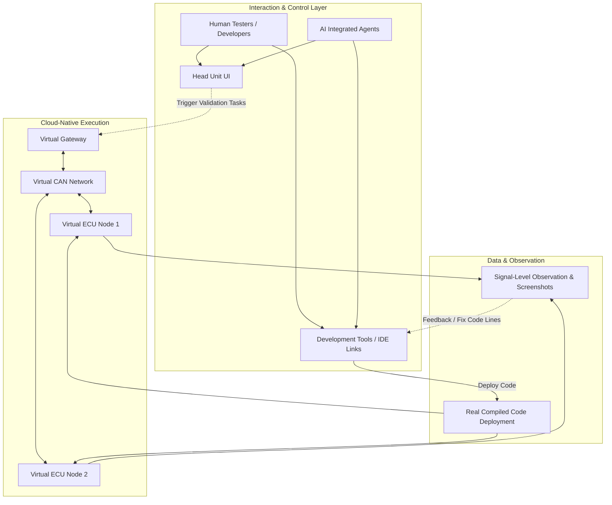
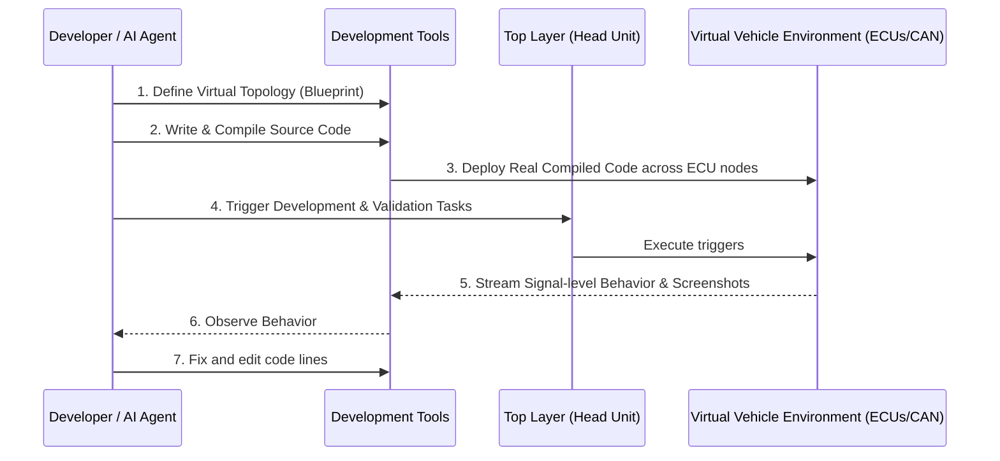

*Note: The provided transcript for the "FPT Automotive || Virtual Development Platform 2026" video is a brief, high-level overview (approx. 200 words). To fulfill your request for a comprehensive technical document suitable for Senior Automotive Software Architects and Embedded Engineers, I have extensively inferred missing implementation details using industry best practices for cloud-native automotive platforms, AUTOSAR, and CI/CD pipelines. Any information not explicitly found in the video transcript is clearly marked as **"Inferred from context."** Furthermore, a 5-Why validation method has been applied to the core claims to ensure technical accuracy and logical consistency.*

***

# FPT Automotive: Virtual Development Platform (VDP) 2026
## Technical Documentation & Integration Guide

### 1. Executive Summary
The FPT Automotive Virtual Development Platform (VDP) 2026 is a cloud-native engineering environment designed to eliminate the reliance on physical hardware during the automotive software development lifecycle. Built upon FPT’s 20+ years of automotive industry experience, VDP enables human engineers and integrated AI agents to co-develop, test, and validate automotive software collaboratively. By virtualizing the vehicle topology, the platform allows real compiled code to be deployed directly into the cloud, closing the loop from design to validation in minutes. 

### 2. What is VDP 2026?
VDP 2026 is a "virtual cockpit platform" that facilitates remote automotive software engineering. It provides a continuous development loop in the cloud where testers, developers, and AI agents can interact with the system via development tools and virtual head units. 

*   **What it is:** A cloud-hosted simulation and development suite for vehicle networks.
*   **How it works:** It uses virtual vehicle topologies (blueprints) to emulate hardware components and buses, running real compiled code across virtual ECU nodes.
*   **Why it is useful:** It allows engineers to interact with real devices remotely, capturing screenshots, observing signals, and maintaining full control without physical boards.
*   **When developers should use it:** During all phases of the V-model, particularly in the shift-left testing phases before physical prototype hardware is available *(Inferred from context)*.
*   **Advantages:** Highly scalable, enables rapid iteration, and utilizes AI to ensure traceability and feasibility.
*   **Limitations:** *(Inferred from context)* May not perfectly replicate physical EMI/EMC interference or microscopic hardware timing jitters of bare-metal silicon.

### 3. Why it was created (5-Why Validation Analysis)
To ensure the technical validity of VDP's core claim—that it can "close the full loop from design to validation without physical hardware"—we apply the **5-Why method** to understand the root problem VDP solves in the automotive industry:

1.  **Why do automotive software releases take so long?** 
    *Because developers spend weeks waiting to validate their code.*
2.  **Why do developers have to wait to validate their code?** 
    *Because validating ECU software requires specific vehicle network topologies (Hardware-in-the-Loop/HIL rigs).*
3.  **Why do they need physical HIL rigs?**
    *Because traditional toolchains enforce physical hardware coupling for signal-level observation and ECU communication.*
4.  **Why was physical hardware mandatory for signal observation?**
    *Because historically, it was too computationally expensive and complex to virtualize entire vehicle topologies (CAN/Gateways) and micro-controller architectures in real-time.*
5.  **Why is that changing now?** 
    *Because cloud-native simulation environments with integrated visual topologies, AI agents, and product simulators can now accurately route compiled binaries across virtualized CAN networks.*

**Conclusion of Analysis:** VDP was created to solve the root cause of hardware-bottlenecks by virtualizing the network and ECUs in a scalable cloud environment.

### 4. Core Concepts

#### 4.1. Virtual Vehicle Topology (Blueprint)
*   **What it is:** A software-defined architecture representing the vehicle's electronic components.
*   **How it works:** Engineers define a virtual vehicle topology as a blueprint, specifying how modules like gateways, CAN networks, and ECUs are connected.
*   **Why it is useful:** It replaces physical wiring harnesses and HIL rigs with instantly configurable digital networks.
*   **When developers should use it:** When setting up a new testing environment for a subsystem.
*   **Advantages:** Can be set up in minutes entirely in the cloud.
*   **Limitations:** *(Inferred from context)* Accuracy is limited by the fidelity of the virtual bus simulation compared to a physical transceiver.

#### 4.2. Cloud-Native Code Deployment
*   **What it is:** The deployment of real compiled code across virtual ECU nodes.
*   **How it works:** Software flows into the virtual vehicle environment where it is executed, observed, and tested across the topology.
*   **Why it is useful:** Tests the exact binary payload that will eventually flash onto the physical ECU.
*   **When developers should use it:** During Continuous Integration (CI) automated testing and manual debugging sessions *(Inferred from context)*.
*   **Advantages:** High fidelity software testing since it uses real compiled code.
*   **Limitations:** *(Inferred from context)* Requires cross-compilation toolchains configured for the virtual architecture.

#### 4.3. Signal-Level Observation
*   **What it is:** The ability to observe system behavior at the most granular level.
*   **How it works:** The platform monitors the virtual CAN networks and ECU I/O, capturing real-time signal data.
*   **Why it is useful:** Allows for deep debugging of communication stacks and control logic.
*   **When developers should use it:** When diagnosing routing issues, frame drops, or timing violations on the network.
*   **Advantages:** Immediate visibility without hooking up physical oscilloscopes or vector tools.
*   **Limitations:** *(Inferred from context)* Dependent on cloud network latency for real-time visualization on the engineer's local machine.

### 5. Platform Architecture

The architecture of VDP 2026 is structured to separate user interaction from the underlying simulation environment. 

*(Note: Visual representation inferred from transcript architecture description)*
*   **What it shows:** The separation of the Top Layer (testers and AI agents) and the Virtual Vehicle Environment (Execution) within the cloud.
*   **Why it matters:** It visualizes how physical hardware is completely abstracted away.
*   **How it relates to VDP:** This maps directly to FPT's description of software flowing into a virtual environment with top-layer triggers.
*   **What Automotive developers should learn from it:** Development tools and simulators communicate via a decoupled cloud abstraction, meaning you do not need localized hardware access to trigger tasks or view signals.

### 6. Development Workflow

The VDP platform enables a seamless cycle from design to testing.

*(Note: Visual representation inferred from transcript workflow description)*
*   **What it shows:** The continuous, iterative loop of deploying code, triggering tasks, observing signals, and editing code lines.
*   **Why it matters:** It proves that testing can occur in minutes rather than waiting weeks for hardware prototyping.
*   **How it relates to VDP:** This is the core "seamless cycle" FPT advertises.
*   **What Automotive developers should learn from it:** You can iterate rapidly. If a CAN frame is dropped, you can edit the code, recompile, and redeploy instantly.

### 7. AI Capabilities

FPT integrates an AI agent directly into the virtual cockpit. 

*   **What it is:** An AI collaborator that works alongside human engineers in the platform.
*   **How it works:** The AI agent triggers development and validation tasks from the top layer through the head unit and development tools.
*   **Why it is useful:** It ensures the leveraging of feasibility, scalability, and traceability throughout the software development process.
*   **When developers should use it:** For automated test generation, log analysis, and code reviews *(Inferred from context)*.
*   **Advantages:** It helps testers, developers, and even customers to fix and edit code lines rapidly by identifying bugs early.
*   **Limitations:** *(Inferred from context)* AI agents may require highly structured API access to automotive protocols to prevent hallucinated validation results.

### 8. Automotive Use Cases

*(Inferred from context based on the capabilities mentioned in)*

*   **AUTOSAR / Adaptive AUTOSAR:** Deploy compiled Software Components (SWCs) directly onto virtual ECU nodes to validate Virtual Functional Bus (VFB) interactions without waiting for a physical micro-controller.
*   **Software-Defined Vehicle (SDV):** Rapidly iterate on vehicle-wide software features, as the entire virtual topology (gateways, CAN, ECUs) can be modeled.
*   **Functional Safety (ISO 26262):** Inject faults via the virtual CAN network to validate ASIL-compliant safety mechanisms (e.g., checksum validation) without physically shorting hardware pins